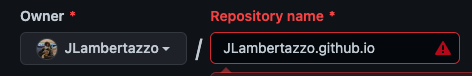

# [VAR_LINK](VAR_LINK)
Welcome to your new portfolio website! Courtesy of the UofT Web Dev Club 🥳

## Fork Instructions
To make this project your own, follow the steps below. We assume you already have a [GitHub](https://github.com) account, if you don't please create one before continuing.
1. Create a fork of this project by going to [https://github.com/uoftweb/VAR_NAME/fork](https://github.com/uoftweb/VAR_NAME/fork)
    * We strongly recommend changing the name of your forked repo to 
    \<your-github-username\>.github.io
    

2. In the github repo for your forked project, go to `Settings -> Pages` and under `Branch` select `main`, then hit the save button.

3. Put the repository name in your browser's address bar, you should be able to see your own website deployed!! 🥳

4. If you run into any problems please message us on the uoftweb discord server for help. We'll be here all year with events, support, and initiatives so come say hi!
[https://www.uoftweb.dev/discord](https://www.uoftweb.dev/discord)

## Personalizing your project
Here are a few ways you can customize your website before you show it to employers:
* Upload your most professional picture to replace the avatar
* Add any project or work experience by copying the existing templates in `index.html`

## About UofTWeb
We want to make you a job-ready full-stack developer before the end of the year. Join us for:
* Web development workshops twice a month
* Mentored projects to show off on your resume
* Social events to meet others with similar interests

*Sign up today if you haven't already and join our discord at [https://www.uoftweb.dev](https://www.uoftweb.dev)*
